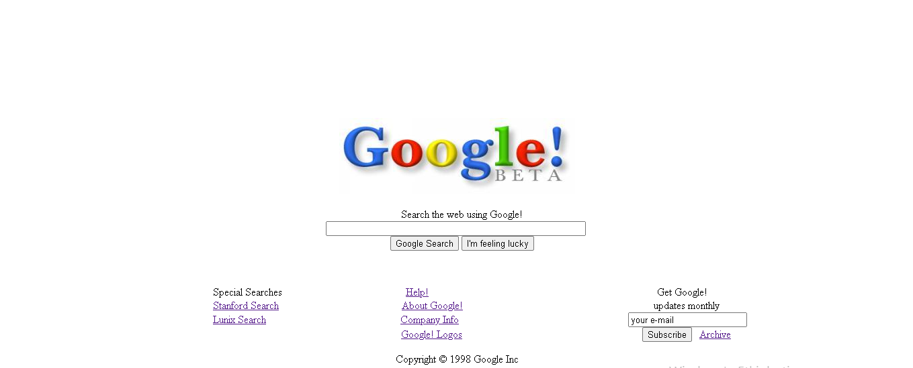

# Tasarımın benzemesi için internetten boşluk karakterini bulup uyguladım ve google iconunu ortalamak için beyaz bir resim kullandım. Benim ekranımdaki görüntü bu şekilde farklı ekran boylarında değişebilir diye ekran görüntüsünü bırakıyorum.
